```{r, include=FALSE}
knitr::opts_chunk$set(echo=FALSE)
```

## Goals

* Help develop an accurate mental model of how reactivity in Shiny works.
* Become confident in when to use `reactive()` vs `observe()`.

<blockquote>
*Once you’ve formed an accurate mental model of reactivity, you’ll see that there’s nothing up Shiny’s sleeves: the magic comes from simple concepts combined in consistent ways.*

*- Hadley Wickham, Mastering Shiny*
</blockquote>

:::notes
- Introduce selves
- This workshop focused on reactivity and how it works in Shiny
- Two goals: develop better understanding of the principles, and better grasp on the building blocks
:::

## Plan

* Reactive programming
* Core building blocks of reactivity
  * Reactive values
  * Reactive expressions
  * Observers
* Other useful tools and patterns
  <!-- * isolate -->
  <!-- * invalidateLater -->
  <!-- * validate and req -->
  <!-- * observe + reactiveValues -->

:::notes
Here's the general plan: we'll do an introduction to what reactive programming is, then talk about the basic building blocks of reactivity (really the core part of our work), and then talk about some other tools that let us have more control over reactivity.

We'll do this through a mix of teaching and exercises. We will take questions as we go and encourage you to interact with us.
:::

## An example app
```r
ui <- fluidPage(
  h1("Example app"),
  sidebarLayout(
    sidebarPanel(
      numericInput("nrows", "Number of rows", 10)
    ),
    mainPanel(
      plotOutput("plot")
    )
  )
)

server <- function(input, output, session) {
  ...
}

shinyApp(ui, server)
```

:::notes
- Point out some terms and definitions
- UI and server
- runApp/shinyApp function
:::

## Reactive Programming

The "magic" that underpins Shiny.

<blockquote>
*The code doesn’t tell Shiny to create the string and send it to the browser, but instead, it informs Shiny how it could create the string if it needs to. It’s up to Shiny when (and even if!) the code should be run.*
</blockquote>

:::notes
How many of you know what reactive programming is or means?

In Shiny, we build all sorts of inputs and outputs and want things to interact with each other. Trying to specify exactly what needs to change with what else can be simple when you only have a couple of components, but as the complexity of what you're trying to build increases, keeping up with that chain can be a mess.

Under the hood, Shiny uses reactive programming, which allows us to simply tell Shiny how to build different components (what code to run to build them), and leave it to Shiny to figure out when certain things should be run, or re-run.
:::


## Exercise 1

Open `Exercise_01.R` and complete the server function. The plot output should show a simple plot of the first `nrows` rows of a built-in dataset - choose any dataset you like (or just use `mtcars`).

:::notes
As an example, let's look at the app that we looked at before. Can you write the server function for this application?
:::

## Solution

```r
output$plot <- renderPlot({
  plot(head(mtcars, input$nrows))
})
```

:::notes
Hopefully your solution looks something like this - yes/no?
Did anyone do anything different? If so what was it?
:::

## Anti-solution

```r
observe({
  df <- head(cars, input$nrows)
  output$plot <- renderPlot(plot(df))
})
```

:::notes
This pattern of putting renderPlot inside of an observe, usually means the author has a fundamental misconception of what it means to assign a render code block to an output slot.
:::

---

`output$plot1 <- renderPlot(...)`

> - **DOESN'T mean:** "Go update the output `"plot1"` with the result of this code."
> - **DOES mean:** "This code is the _recipe_ that should be used to update the output `"plot1"`."

:::notes
All we are doing is telling Shiny what code it should run when it needs to show/find plot1
We aren't telling it when to run plot1 - that's Shiny's job
Shiny will try and run things as few times as possible - that's reactive programming
So, we should try to write things in a way that's conducive to reactive programming (lean into it)
:::

# Core building blocks

## Reactive values

Shiny has two types of reactive values:

* A single reactive value, created by `reactiveVal()`.
* A list of reactive values, created by `reactiveValues()`.

---

They have slightly different ways of getting and setting the values:
```r
x <- reactiveVal(10)
x()       # get
#> [1] 10
x(20)     # set
x()       # get
#> [1] 20

r <- reactiveValues(x = 10)
r$x       # get
#> [1] 10
r$x <- 20 # set
r$x       # get
#> [1] 20
```

The role of reactive values is to store the state of some value. When the value changes, the reactive value notifies anything that uses it that it has changed.

:::notes
While reactiveVal and reactiveValues look different, they behave the same, so which you use is up to you.
`input` is an example of a read-only reactiveValues object (i.e. you can't directly set values in it, only get).
:::

## Reactive expressions

Expression: Code that produces a value

Reactive: It detects changes in any values it reads / uses

We create reactive expressions using `reactive()`.

---

```r
server <- function(input, output, session) {
  # When input$min_size or input$max_size change, large_diamonds
  # will be notified about it.
  large_diamonds <- reactive({
    diamonds %>%
      filter(carat >= input$min_size) %>%
      filter(carat < input$max_size)
  })
  
  # If that happens, large_diamonds will notify output$table.
  output$table <- renderTable({
    large_diamonds() %>% select(carat, price)
  })
```

---

```r
  ... continued ...

  # Reactive expressions can use other reactive expressions.
  mean_price <- reactive({
    mean(large_diamonds()$price)
  })
  
  # large_diamonds and mean_price will both notify output$message
  # of changes they detect.
  output$message <- renderText({
    paste0(nrow(large_diamonds()), " diamonds in that range, ",
      "with an average price of $", mean_price())
  })
}
```

---

```r
server <- function(input, output, session) {
  
  # This DOESN'T work.
  large_diamonds <- diamonds %>%
    filter(carat >= input$min_size) %>%
    filter(carat < input$max_size)
  
  output$table <- renderTable({
    large_diamonds %>% select(carat, price)
  })
}
```

`large_diamonds` would only be calculated once, as the session starts (i.e. as the page first loads in a browser).

---

Reactive expressions help out in a couple of ways:

- Make it easier for humans to understand the app and dependencies
- Improve Shiny's ability to efficiently rerun code

Reactive expressions are usually formed by pulling out repeated computation

:::notes
Do reactive expressions sound familiar in these descriptions? Should do - functions!
If anyone asks - functions and reactives both callable and return a value, and only run when called, but reactives are cached and functions are not
:::

## Exercise 2

Open `Exercise_02.R`. There's a new `tableOutput("table")` in ui.R. Have it show the same data frame that is being plotted, using `renderTable`.

**Make sure that the `head()` operation isn't performed more than once for each change to `input$nrows`.**

## Solution
```r
server <- function(input, output, session) {

  df <- reactive({
    head(cars, input$nrows)
  })
  
  output$plot <- renderPlot({
    plot(df())
  })
  
  output$table <- renderTable({
    df()
  })
}
```

:::notes
Hopefully most people got this. Did anyone not get this? What did they get?
:::

## Anti-solution

```r
server <- function(input, output, session) {

  values <- reactiveValues(df = cars)
  observe({
    values$df <- head(cars, input$nrows)
  })
  
  output$plot <- renderPlot({
    plot(values$df)
  })
  
  output$table <- renderTable({
    values$df
  })
}
```

:::notes
Here's something else that works. Did anyone do this?
This works, but isn't the preferred / Shiny best practice approach
Hopefully by end of this workshop you understand why
:::

## Exercise 3

Open `Exercise_03.R`.

This is a working app with several tabs. You choose variables from the iris dataset, and on different tabs there is information on the selected variables. A linear model also gets fit.

Right now, each of the four outputs contains copied-and-pasted code for selected the chosen variables, and fitting the model. Can you refactor the code so that it's more maintainable and efficient?

## Solution

```r
  selected <- reactive({
    iris[, c(input$xcol, input$ycol)]
  })
  
  model <- reactive({
    lm(paste(input$ycol, "~", input$xcol), selected())
  })
```

:::notes
Here's another exercise. Hopefully pretty straight forward
How much you decompose reactives is very much like with functions - trade off between size and understanding
:::

## Reactive Graph

```{r, out.width='90%', fig.align='center'}
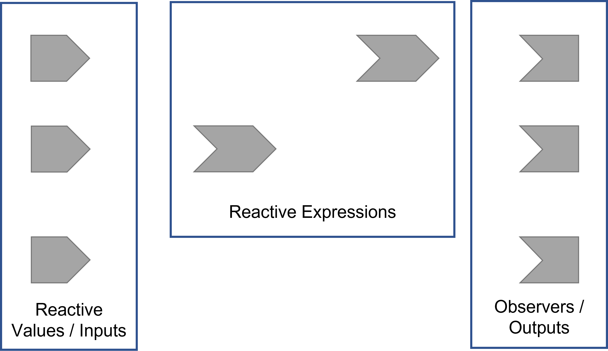
```

:::notes
One tool that's useful for us to understand how Shiny utilises reactive programming and the role reactive expressions play is the reactive graph. This lets us see the various reactive components of the app.

The inputs or reactive values are producers, because you can use their results in an output
The outputs or observers are consumers, because they depend on inputs and automatically know when they need updating
The reactive expressions are both producers and consumers - you can use their results in an output, and also depend on inputs and know when they need updating.
:::

## Shiny starts with this... {.flexbox .vcenter}

```{r, out.width='100%', fig.align='center'}
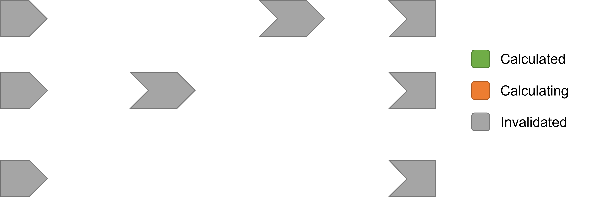
```

## ...and figures out this {.flexbox .vcenter}

```{r, out.width='100%', fig.align='center'}

```

:::notes
So now we can see the components. Shiny will go through and link the components, figuring out what things are dependent on what other things.
:::

## Exercise 4

Have a look at the apps in `Exercise_04a.R` and `Exercise_04b.R`. These apps are a slightly modified version of the exercise and solution from Exercise 2.

Can you draw the reactive graph for each of these apps?

## Solution {.flexbox .vcenter}

<div class="columns-2">
```{r, out.width='100%', fig.align='center', fig.cap="Solution to Exercise 4a"}
knitr::include_graphics('solutions/Solution_04a.png')
```

```{r, out.width='100%', fig.align='center', fig.cap="Solution to Exercise 4b"}
knitr::include_graphics('solutions/Solution_04b.png')
```
</div>


## Reactive execution on session start {.flexbox .vcenter}

```{r, out.width='100%', fig.align='center'}

```

## Reactive execution on session start {.flexbox .vcenter}

```{r, out.width='100%', fig.align='center'}
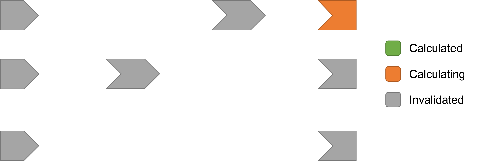
```

## Reactive execution on session start {.flexbox .vcenter}

```{r, out.width='100%', fig.align='center'}
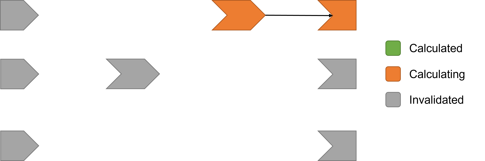
```

## Reactive execution on session start {.flexbox .vcenter}

```{r, out.width='100%', fig.align='center'}
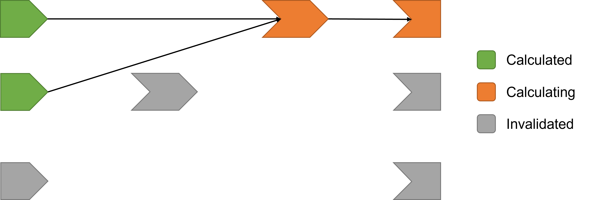
```

## Reactive execution on session start {.flexbox .vcenter}

```{r, out.width='100%', fig.align='center'}
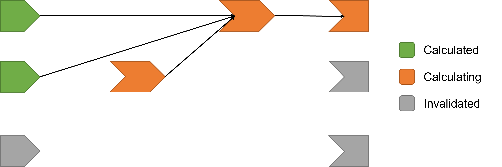
```

## Reactive execution on session start {.flexbox .vcenter}

```{r, out.width='100%', fig.align='center'}

```

## Reactive execution on session start {.flexbox .vcenter}

```{r, out.width='100%', fig.align='center'}
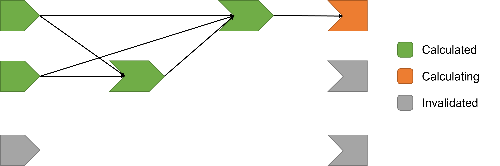
```

## Reactive execution on session start {.flexbox .vcenter}

```{r, out.width='100%', fig.align='center'}
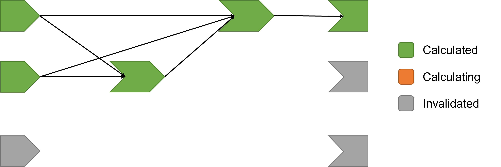
```

## Reactive execution on session start {.flexbox .vcenter}

```{r, out.width='100%', fig.align='center'}
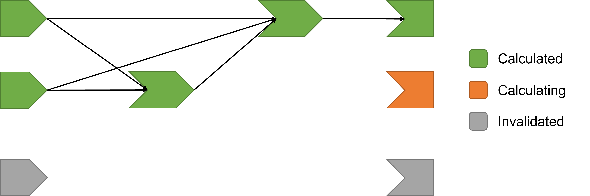
```

## Reactive execution on session start {.flexbox .vcenter}

```{r, out.width='100%', fig.align='center'}
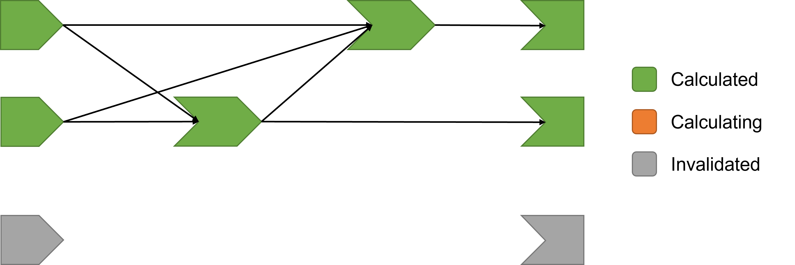
```

## Reactive execution on session start {.flexbox .vcenter}

```{r, out.width='100%', fig.align='center'}
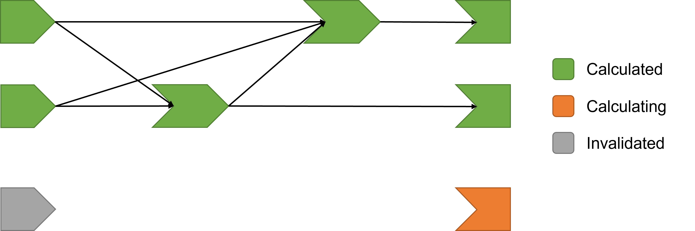
```

## Reactive execution on session start {.flexbox .vcenter}

```{r, out.width='100%', fig.align='center'}
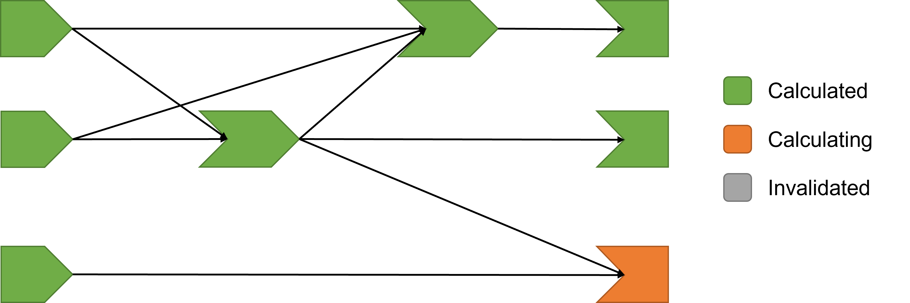
```

## Reactive execution on session start {.flexbox .vcenter}

```{r, out.width='100%', fig.align='center'}
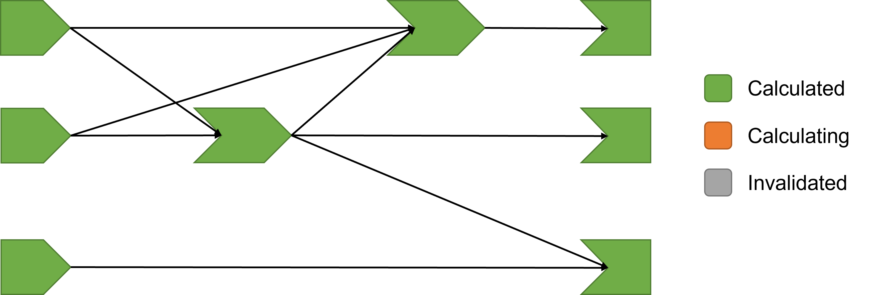
```

:::notes
Shiny figures out what the dependencies are between the different components not by static analysis (i.e. looking at code), but by runtime analysis - that is, it tries to build the outputs and sees what reactive expressions and values get read when building those things.

Initially, everything is invalidated. Then Shiny starts trying to build each of the outputs.
As it builds each output, it sees, hey I need this value, and creates a dependency on that input/value.

We see that Shiny doesn't need to re-calculate a reactive expression it's calculated before, it just uses that value
The reactive expression caches that value for those inputs and stores it. then delivers that value when it's asked for it.
:::

## Reactive execution on input change {.flexbox .vcenter}

```{r, out.width='100%', fig.align='center'}
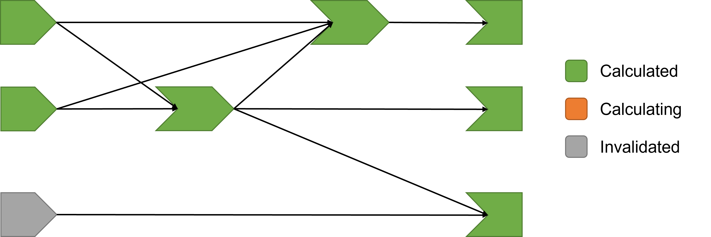
```

## Reactive execution on input change {.flexbox .vcenter}

```{r, out.width='100%', fig.align='center'}
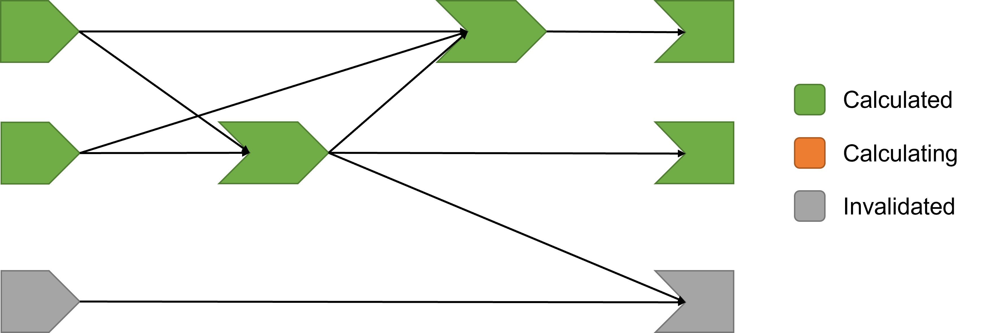
```

## Reactive execution on input change {.flexbox .vcenter}

```{r, out.width='100%', fig.align='center'}

```

## Reactive execution on input change {.flexbox .vcenter}

```{r, out.width='100%', fig.align='center'}

```

## Reactive execution on input change {.flexbox .vcenter}

```{r, out.width='100%', fig.align='center'}

```

## Reactive execution on input change {.flexbox .vcenter}

```{r, out.width='100%', fig.align='center'}

```

:::notes
Now let's see how Shiny deals with an input changing.
The input change causes that input to become invalidated. When this happens, anything that it depends on downstream becomes invalidated.

Those downstream objects remove all its prior links.

Now we try to rebuild/recompute the outputs. It looks back at the inputs, sees what it needs, then resolves itself.
:::

## A real reactive graph

```{r, out.width='100%', fig.align='center'}
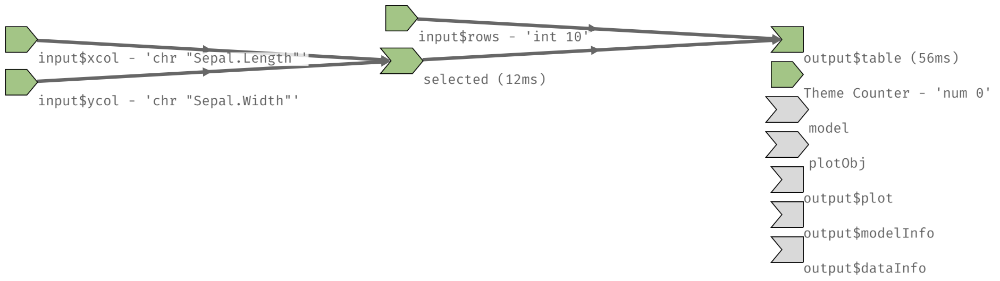
```

Generate by:

1. Running `options(shiny.reactlog=TRUE)` in console.
2. Running the app (e.g. `shinyApp(ui, server)`).
2. Using shortcut Ctrl + F3.

:::notes
Here's a real reactive graph, for the app in Solution_03. We can generate this by setting the option, running the app and using the keyboard shortcut from the app.

Now show the reactive graph, step through it.

Point out that, by default, some things remain invalidated. Ask why that is?
It's because those things aren't shown on the dashboard, so Shiny is never asked to generate them for the application. (they're in tabs).

The minute we switch tabs, Shiny needs to generate and show them.
:::

## Takeaways about reactive expressions

> - Reactive expressions are callable; when called they return a value
> - Reactive expressions are lazy - they only run their code when they are called upon
> - Reactive expressions are cached - after they are calculated for the first time, they store their value and continue serving it until an input has changed

:::notes
Is everyone convinced / agree about these properties?
If no? lets take a break, we can discuss.
Almost most of the time we're doing a calculation we can just use a `reactive()`.
:::

---

```r
server <- function(input, output, session) {
  statement <- reactive({
    # This code will never execute!
    cat("The value of input$x is now ", input$x, "\n")
  })
}
```

---

```r
server <- function(input, output, session) {
  statement <- reactive({
    # Now this code will execute...
    cat("The value of input$x is now ", input$x, "\n")
  })
  
  # ... because the reactive expression is getting called.
  observe({
    statement()
  })
}
```

## Observers

Blocks of code that perform an action and do not return a value

They respond to a change in reactive values or expressions

```r
observe({
  cat("The value of input$x is now ", input$x, "\n")
})
```

:::notes
Observers are the other major building block. Between observers and reactive expressions we can get just about everything done.

Actions - side effects - anyone doesn't know what a side effect is?
Tangent - side effect - some other effect that is not the return value. We usually write functions to either have a side effect or return a value.
:::

---

Two main types of observers:

1. Implicit: Depend on all reactive values or expressions that it encounters in its recipe
2. Explicit: Depends on specific reactive values or expressions only

```r
server <- function(input, output, session) {

  # Executes immediately, and repeats whenever input$x changes.
  observe({
    cat("The value of input$x is now ", input$x, "\n")
  })
  
  # Only executes when input$save_data is pushed. Will not execute in response to changes in df()
  observeEvent(input$save_data, {
    write.csv(df(), "output.csv")
  })
}
```

:::notes
Observers should really only exist at the top level, since they are the final consumers of the reactivity chain. 
:::

## Exercise 5

Open `Exercise_05.R`. 

This app is meant to print the output of the `summary` function run across the chosen column of the chosen dataset. However, it doesn't work currently because there are no choices!

Modify the server function so that the select input shows the columns that can be selected for each given dataset, and so that the text output shows the correct output.

Hint: check out `updateSelectInput`.

## Solution

```r
server <- function(input, output, session) {
  df <- reactive({get(input$dataset)})

  observe({
    updateSelectInput(
      session,
      "col",
      "Columns",
      choices = colnames(df())
    )
  })

  output$summary <- renderPrint({
    summary(df()[, input$col])
  })
}
```

## Exercise 6

Open `Exercise_06.R`. 

Modify the server function so that a sample of the chosen dataset, with the specified number of rows, gets written to csv **only** when the "Save sample" button is pressed.

## Solution

```r
server <- function(input, output, session) {
  df <- reactive({get(input$dataset)})

  sample <- eventReactive(input$save, {
    head(df(), input$nrows)
  })

  observeEvent(input$save, {
    write.csv(sample(), "sample.csv")
  })
}
```

## Recap on the building blocks

> - Reactive values: `reactiveVal()` or `reactiveValues()`
> - Reactive expressions: `reactive()`
> - Observers: `observe()` and `observeEvent()`

:::notes
So, we've covered the main building blocks of reactive programming that Shiny uses.
Let's recap the properties of reactive expressions and observers in a bit more depth, so we can really draw out and come to the conclusion of when we should use each.

To help with this, I'm going to use some lines from Joe Cheng at RStudio.
:::

## `reactive()`

<blockquote>
> 1. It **can be called** and **returns a value**. Either the last expression, or `return()`.
> 2. It's **lazy**. It doesn't execute its code until somebody calls it (even if its reactive dependencies have changed).
> 3. It's **cached**. The first time it's called, it executes the code and saves the resulting value. Subsequent calls can skip the execution and just return the value.
> 4. It's **reactive**. It is notified when its dependencies change. When that happens, it clears its cache and notifies it dependents.
</blockquote>

---

<blockquote>
The fact that reactive expressions are **lazy** and **cached**, is critical.

It's **hard to reason about** when reactive expressions will execute their code—or whether they will be executed at all.

All Shiny guarantees is that **when you ask a reactive expression for an answer, you get an up-to-date one**.
</blockquote>

## `observe()` / `observeEvent()`

<blockquote>
> 1. It **can't be called** and **doesn't return a value**. The value of the last expression will be thrown away, as will values passed to `return()`.
> 2. It's **eager**. When its dependencies change, it executes right away.
> 3. (Since it can't be called and doesn't have a return value, there's no notion of caching that applies here.)
> 4. It's **reactive**. It is notified when its dependencies change, and when that happens it executes (not right at that instant, but ASAP).
</blockquote>

---

| `reactive()`    | `observe()`     |
|-----------------|-----------------|
| Callable        | Not callable    |
| Returns a value | No return value |
| Lazy            | Eager           |
| Cached          | _N/A_           |

## Summary

- `reactiveVal()` / `reactiveValues()` is for *holding state of some value(s)*.
- `reactive()` is for *calculating values, without side effects*.
- `observe()` is for *performing actions, with side effects*.

:::notes
This is what each of these is good for. Do not use an `observe` when calculating a value, and especially don't use `reactive` for performing actions with side effects.

Calculations are where you don't care about whether the code has run or not, you just want the answer
Actions are where you care that the code has run and there is no answer, only side effects.
If you think you want both an answer and some code to run - then you should split into two bits
:::

# Other useful tools and patterns

---

95% of the time in Shiny, we can achieve everything with `reactive` and `observe`. 

> - `isolate` - use reactive values / expressions without creating reactive dependency
> - `invalidateLater` - force things to become invalidated and therefore recalculate
> - `req`, `validate` and `need` - ways of checking for missing or valid input values

## `isolate()`

`isolate(expr)` will execute the code in the `expr` using reactive values or expressions, but won't establish a dependency on those reactive values or expressions.

---

```r
# This loops infinitely! The observer creates a dependency 
# on both r$x and r$count, and modifies r$count.
r <- reactiveValues(count = 0, x = 1)
observe({
  r$x
  r$count <- r$count + 1
})

# This doesn't loop infinitely, since the observer doesn't 
# create a dependency on r$count as it is isolated.
r <- reactiveValues(count = 0, x = 1)
observe({
  r$x
  r$count <- isolate(r$count) + 1
})
```

---

`observeEvent` is effectively `observe` + `isolate`:

```r
# These are equivalent!
observe({
  input$update_button
  isolate(cat("The selected value is", input$selected))
})

observeEvent(input$update_button, {
  cat("The selected value is", input$selected)
})
```

In the same way, `eventReactive` is `reactive` + `isolate`!

<!-- ## Exercise TODO -->

<!-- Write some exercise here -->

## `invalidateLater`

`invalidateLater(ms)` lets us cause any reactive consumer to be invalidated in the future, after `ms` milliseconds. This will force them to re-run.

Some uses:

- Creating animations
- Polling / refreshing data sources that might be changing over time

```r
# Generate 10 fresh random numbers from the normal distribution ever 0.5 seconds
x <- reactive({
  invalidateLater(500)
  rnorm(10)
})
```

<!-- ## Exercise TODO -->

<!-- Write some exercise here -->

## `req`, `validate` and `need`

Sometimes we want to handle missing input values, or validate input values that users have provided (e.g. in a textInput). Shiny provides a few functions to assist with this:

- `req(value)` ensures that values are available before proceeding. 
- `validate(tests)` ensures that all the tests defined pass before continuing output
- `need(expr)` is how we define tests to be used in the `validate` function

---

Important distinction between `req` vs `validate` + `need`: 

> - If `req` fails, it stops operation by raising a "silent" exception
> - If `validate` fails, and no error handling code is written, Shiny will display an error message to the user

:::notes
There's a good example in Joe Cheng's talk in the use of req, we can include it if needed
:::

## Exercise 7

Open `Exercise_07.R`. Here is an app that shows some error messages on the UI when columns haven't yet been correctly selected.

Try writing some Shiny code to handle these errors in two different ways:

1. Using `req()`.
2. Using `validate()` and `need()`.

What do you notice about the differences between the two solutions?

## Observe + reactiveValues (extra)

Most things in Shiny can be achieved with a combination of `reactive` and `observe`. (for everything else, there's Mastercard).

Sometimes you need to break free of the constraints of Shiny's reactive programming framework.

We do this through a combination of `reactiveValues()` and `observe()/observeEvent()`.

## Observe + reactiveValues

Pro: We gain some manual control over certain interactions/reactions.

Con: It allows the app to do unnecessary work, and can allow us to create infinite loops in our app!

## The anti-pattern

Let's re-look at this example.

```r
function(input, output, session) {

  values <- reactiveValues(df = cars)
  observe({
    values$df <- head(cars, input$nrows)
  })
  
  output$plot <- renderPlot({
    plot(values$df)
  })
  
  output$table <- renderTable({
    values$df
  })
}
```

---

Why was that an anti-pattern?

> - If the plot and table aren't visible, they will get plotted anyway (the observe is eager, and so are the outputs).
> - If the observe code errors, the app gets terminated. If we used a reactive, the error gets propogated and displayed instead of terminating the app.
> - Shiny doesn't create a reactive dependency between the `observe` (a reactive consumer / end point) and the `reactiveValues` object (a reactive producer). This means it's harder to analyse for you, and harder to optimise for Shiny.

:::notes
This code is the anti-solution from Exercise 2. Why is it bad? In this case, it doesn't actually do much more work than the Shiny-first / reactive expression approach.

Three drawbacks:
- if the plot and table aren't actually visible, they still get plotted anyway (reactive approach doesn't get plotted)
  - reason through it: observe means `values$df` gets updated always when `input$nrows` changes, values$df triggers outputs to update

- if observe code chunk errors, the observe terminates the app.

- Shiny can't actually see the link between the reactiveValue and the observe - is really the main drawback. the reactive graph shows that Shiny doesn't look like nrows is linked to reactiveValue. Means Shiny can't optimise as easily. 
:::

## Good use cases

1. One output that is modified by multiple inputs
2. Accumulating values over time
3. Pausing calculations / adding latency

:::notes
Here are some examples, as provided by Hadley in Mastering Shiny
:::

## Out output modified by multiple inputs

```r
ui <- fluidPage(
  actionButton("drink", "drink me"),
  actionButton("eat", "eat me"),
  textOutput("notice")
)
server <- function(input, output, session) {
  r <- reactiveValues(notice = "")
  observeEvent(input$drink, {
    r$notice <- "You are no longer thirsty"
  })
  observeEvent(input$eat, {
    r$notice <- "You are no longer hungry"
  })
  output$notice <- renderText(r$notice)
}
```

:::notes
Here we have an application where we have two buttons to trigger one notice. 
:::

## Accumulating values over time

```r
ui <- fluidPage(
  textInput("name", "name"),
  actionButton("add", "add"),
  actionButton("del", "delete"),
  textOutput("names")
)
server <- function(input, output, session) {
  r <- reactiveValues(names = character())
  observeEvent(input$add, {
    r$names <- union(r$names, input$name)
    updateTextInput(session, "name", value = "")
  })
  observeEvent(input$del, {
    r$names <- setdiff(r$names, input$name)
    updateTextInput(session, "name", value = "")
  })
  
  output$names <- renderText(r$names)
}
```

:::notes
This application has a box for us to write a name, and a button to either add or delete names from the total list.
The pattern is very similar to the above, where there are several different types of calculations and ways of updating that one value.
:::

## Pausing calculations / adding latency

```r
ui <- fluidPage(
  actionButton("start", "start"),
  actionButton("stop", "stop"),
  textOutput("n")
)
server <- function(input, output, session) {
  r <- reactiveValues(running = FALSE, n = 0)

  observeEvent(input$start, {
    r$running <- TRUE
  })
  observeEvent(input$stop, {
    r$running <- FALSE
  })
  
  observe({
    if (r$running) {
      r$n <- isolate(r$n) + 1
      invalidateLater(250)
    }
  })
  output$n <- renderText(r$n)
}
```

:::notes
This app increments every 250 seconds. Our buttons start or stop the incrementation with the running reactive value.

We can't just use observeEvent for the increment since we want to do different things depending on whether or not we should be running or not.
:::

## Exercise 8

Open `Exercise_08.R`. Complete the server function for the given UI, using the `observe` + `reactiveValues` pattern you have just learned.
