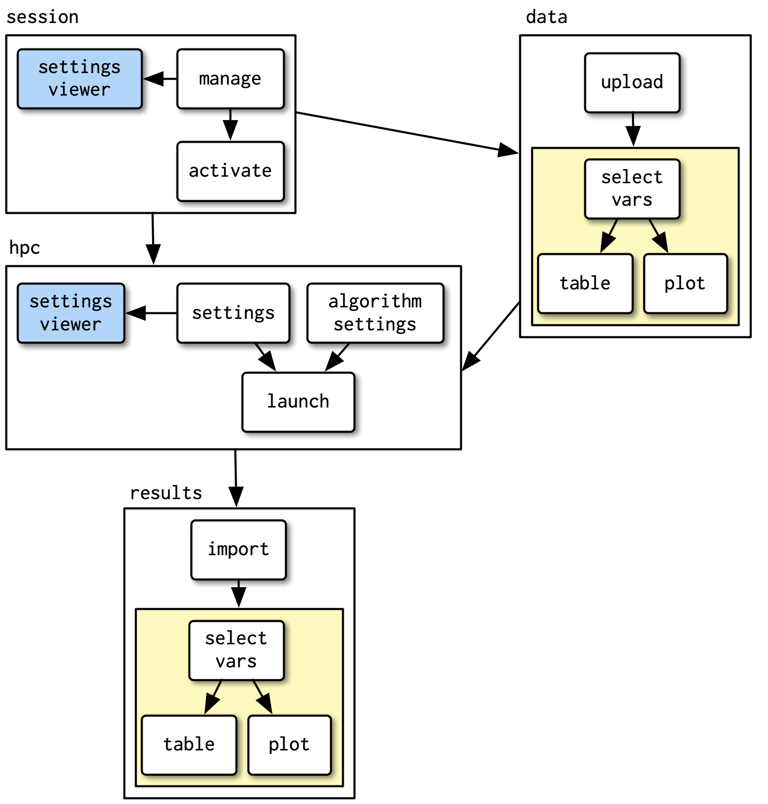

## Problem

Basic Shiny apps can be stood up very quickly, however when building complex apps this ease of access can cause issues if not well understood

* We must optimise through reactivity and ensure a smooth user experience


* Strive for any functionality being visible in a single window


{height=160px width=800px}

:::notes
This comes back to the idea of magic, you want just the right amount. As apps grow it can be hard to grasp whats going on. The image may be relatable to some, 300 lines deep and seeing a large nesting of brackets.
:::

## Solution - Functions

Functionalise code, or more specifically for shiny, modularise code

* Functions are a fundamental principle to good coding

```{r eval=FALSE, include=TRUE}
add <- function(x,y){
  return(x+y)
}
add(2,4)
#>6
```

* You can give a function an evocative name that makes your code easier to understand.

* As requirements change, you only need to update code in one place, instead of many.

* You eliminate the chance of making incidental mistakes when you copy and paste (i.e. updating a variable name in one place, but not in another).

:::notes
Make sure everyone understands what a function is. That you can explicitly supply return (my preference), or it returns the last thing executed. Also additional point important for shiny is the fact that it compartmentalises 
:::

## Namespace Problem

inputs and outputs share a global namespace and have to be unique across an entire application

<blockquote>
If you’re using functions to generate UI, and those functions generate inputs and outputs, then you need to ensure that none of the IDs collide.
</blockquote>

`plotOutput("graph1")`

`plotOutput("graph2")`

`plotOutput("graph3")`

`textOutput("graph1_text")`

`textOutput("graph2_text")`

`textOutput("graph3_text")`

## What Are Modules
* Modules can represent input, output, or both.
* They are functions that address shiny namespace issues.

```{r, class.output="scroll-100", eval=FALSE, include=TRUE}
module_UI <- function(id) {
  ns <- NS(id)
  tagList( 
    #UI elements
    )
}

module_server <- function(id) {
  moduleServer(
    id,
    function(input, output, session) {
      #Server logic
    }
  )
}
```

:::notes
tagList is just a fancy list, just tells shiny how to produce the HTML correctly. Can deal with UI layout outside of module
:::

## What Are Modules

```{r, class.output="scroll-100", eval=FALSE, include=TRUE}
randUI <- function(id) {
  ns <- NS(id)
  tagList(
    actionButton(ns("button"), label = "Generate"),
    verbatimTextOutput(ns("out"))
  )
}

randServer <- function(id) {
  moduleServer(
    id,
    function(input, output, session) {
      
      output$out <- renderText({
        input$button
        runif(1)
      })
    }
  )
}
```

## What Are Modules - Continued

```{r, class.output="scroll-100", eval=FALSE, include=TRUE}
ui <- fluidPage(
  randUI("randomNumber")
)

server <- function(input, output, session) {
  randServer("randomNumber")
}

shinyApp(ui, server)
```


*01_slide_content.R*

## Closer Look - UI
```{r, class.output="scroll-100", eval=FALSE, include=TRUE}
randUI <- function(id) {
  ns <- NS(id)
  tagList(
    actionButton(ns("button"), label = "Generate"),
    verbatimTextOutput(ns("out"))
  )
}
```

* A function that takes an `id` as the argument 
* `NS()` is used within randUI to encapsulate the module's UI
* common practice to assign `NS(id)` to `ns`
* any reference to an input within the module will now be surrounded by `ns()`
* returns a tagList of UI elements


```{r, class.output="scroll-100", eval=FALSE, include=TRUE}
ns <- NS("randomNumber") 
ns("button") # NS("randomNumber","button")
#randomNumber-button
```

::: notes
Page will have id randomNumber-out and randomNumber-button. Encourage to inspect and see this.
Talk about how this isolation makes problem solving and code management much easier
:::

## Closer Look - Server
```{r, class.output="scroll-100", eval=FALSE, include=TRUE}
randServer <- function(id) {
  moduleServer(
    id,
    function(input, output, session) {
      
      output$out <- renderText({
        
        input$button
        
        runif(1)
      })
    }
  )
}
```

* A function that takes an `id` as the argument 
* requires `moduleServer()` with two arguments, `id` and a server function
* any reference to an input within the module will be as normal

## Exercise 1 - Modularise a counting button

**exercise_01.R**

Bonus

* Make the module dynamic in the amount added
* Use apply family to create multiple counting buttons on a single app


:::notes
Might need to make sure they understand non-modular version first.
:::

## Why Bother

* **Break down complicated code**
* Reusable
* R packages to be used by other Shiny authors

{height=430px width=380px} | {height=430px width=380px}

:::notes
Exercise 1 actually results in more code which might be unintuitive. Think about scaling this up to a
dashboard, particularly if there are repeated components.
:::

## Deciding When to Use Modules

* Consider a function when you see repeating code
* Consider a function when you see a large process that has clear inputs and outputs

* Use a module pair if this function involves UI and Server interaction

<blockquote>
Shiny's module feature lets you break complicated UI and server logic into smaller, self-contained pieces. Compared to large monolithic Shiny apps, modules are easier to reuse and easier to reason about. 
</blockquote>

## Project Folder Structure

Keep modules together, in an R folder. Note refreshing apps


## Project Folder Structure


:::notes
Just like R packages, only the files at the top level of R/ are considered; nested directories are ignored. Files in this directory are sourced in alphabetical order and any variables, functions, or modules they create are available to be used in your app.R, ui.R, or server.R files.
:::

## Taking in Static Data

These are functions, so we can provide more than just an id.

```{r, class.output="scroll-100", eval=FALSE, include=TRUE}
summary_server <- function(id, dataset) {
  moduleServer(
    id,
    function(input, output, session) {
      output$summary <- renderText(summary(dataset))
    }
  )
}
```

```{r, class.output="scroll-100", eval=FALSE, include=TRUE}
server <- function(input, output, session) {
  summary_server("iris",iris)
  summary_server("cars",cars)
  summary_server("pressure",pressure)
}
```

*02_slide_content.R*

## Exercise 2 - Passing Static Objects

**exercise_02.R**

Modularlise the code to take any vector of numbers and custom heading.

Bonus: Provide data frame instead and dynamically choose column (vector)


## Taking in Reactive Data

Modules can take both static and reactive objects
```{r, class.output="scroll-100", eval=FALSE, include=TRUE}
  val <- reactiveVal(1)
  
  vals <- reactiveValues(val_a = 1,
                         val_b = 2)
  
  dataset <- reactive({head(iris,input$nrows)})
  
  module_server(id = "id_1", arg1 = val) #Works
  module_server(id = "id_1", arg1 = val()) #Doesn't work
  
  module_server(id = "id_2", arg1 = vals) #Works
  module_server(id = "id_2", arg1 = vals$val_a) #Doesn't work
  
  module_server(id = "id_3", arg1 = dataset) #Works
  module_server(id = "id_3", arg1 = dataset()) #Doesn't work
  
  module_server(id = "id_4", arg1 = reactive({input$val})) #Works
  module_server(id = "id_4", arg1 = input$val) #Doesn't work
```


## Exercise 3 - Passing in Reactive Objects

**exercise_03.R**

Let the dataset be a reactive object that is passed to modules e.g histogram module based on dataset column

Bonus: explain and resolve the temporary error

## Nested Modules

* Modules can be nested
* This is great for breaking down complex apps into sub components e.g. dashboard

```{r, class.output="scroll-100", eval=FALSE, include=TRUE}
library(shiny)

playerBreakDownUI <- function(id){
  ns <- NS(id)
  tagList(plotOutput(ns("plot")),
          tableOutput((ns("table"))),
          verbatimTextOutput(ns("summary_text"))
  )
}
```

*03_slide_content.R*

## Nested Modules

```{r, class.output="scroll-100", eval=FALSE, include=TRUE}
overviewPageUI <- function(id){
  ns <- NS(id)

  fluidRow(
    column(6,playerBreakDownUI(ns("player"))),
    column(6, teamBreakDownUI(ns("team")))
  )

}

ui <- fluidPage(
  tabsetPanel(type = "tabs",
              tabPanel("Overview",
                       overviewPageUI("overview")),
              tabPanel("Plots",
                       plotPageUI("plot"))
  )
)
```
*04_slide_content.R*

## Composing Modules

Modules can return an object

```{r, class.output="scroll-100", eval=FALSE, include=TRUE}
selectNumberServer <- function(id){

  moduleServer(id,function(input,output,session){

    my_row <- reactive(input$num)

    return(my_row)
  })
}

server <- function(input, output) {
  
  row_number <- selectNumberServer("sel")
  tableServer("tbl",row_number)
  
}
```

## Exercise 4 - Composing Modules

*exercise_04.R*

## Things to Note

* Modules were introduced in Shiny 0.13 (Jan 2016) with `callModule()` and overhauled in Shiny `1.5.0` (June 2020) with the introduction of `moduleServer()`

* `stopifnot(is.reactive(df))`, it is good practice to check each input to a module is either reactive or constant

## Workshop Exercise

Building a dashboard


